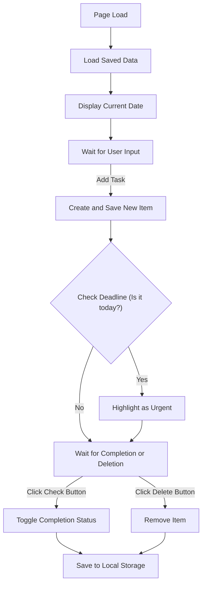

# 할 일 관리 웹앱 - 플로우 차트

다음은 할 일 관리 웹앱의 기능 흐름을 보여주는 Mermaid.js 플로우 차트입니다.

```mermaid
graph TD;
    A[Page Load] --> B[Load Saved Data];
    B --> C[Display Current Date];
    C --> D[Wait for User Input];

    D -->|Add Task| E[Create and Save New Item];
    E --> F{"Check Deadline (Is it today?)"};

    F -- No --> G[Wait for Completion or Deletion];
    F -- Yes --> H[Highlight as Urgent] --> G;

    G -->|Click Check Button| I[Toggle Completion Status];
    G -->|Click Delete Button| J[Remove Item];

    I --> K[Save to Local Storage];
    J --> K;
```
