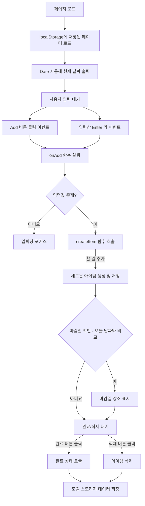

### 추가 기능 구현

- 날짜 출력
- 마감일자 포함 데이터 입력
- 마감일자 당일 시 강조 표시
- 로컬 스토리지에 저장

```mermaid
graph TD;
    A[페이지 로드] --> B[localStorage에 저장된 데이터 로드]
    B --> C[Date 사용해 현재 날짜 출력]
    C --> D[사용자 입력 대기]

    D --> L[Add 버튼 클릭 이벤트]
    D --> M[입력창 Enter 키 이벤트]
    L --> N[onAdd 함수 실행]
    M --> N

    N --> O{입력값 존재?}
    O -- 아니오 --> P[입력창 포커스]
    O -- 예 --> Q[createItem 함수 호출]
    Q -->|할 일 추가| E[새로운 아이템 생성 및 저장]
    E --> F{마감일 확인 - 오늘 날짜와 비교}

    F -- 아니요 --> G[완료/삭제 대기]
    F -- 예 --> H[마감일 강조 표시] --> G

    G -->|완료 버튼 클릭| I[완료 상태 토글]
    G -->|삭제 버튼 클릭| J[아이템 삭제]

    I --> K[로컬 스토리지 데이터 저장]
    J --> K

```
